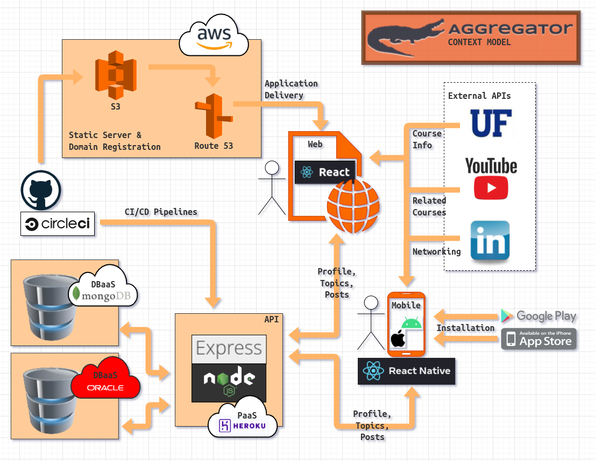

# AggreGator - A CEN3031 Project

**FOR** current and former University of Florida students and professors **WHO** want to prepare for upcoming courses, perform well in their current studies, and remain updated on the latest industry trends, **THE** AggreGator is a web-based service **THAT** provides a forum for Gators to discuss, ask questions, share material, and encourage each other achieve their goals in the classroom and the boardroom. **UNLIKE** other message boards or blog services, **OUR** product is the only service of its kind made by Gators and only for Gators past, present, and future.

## Authors

- **[Brian Hoblin](https://github.com/GoonerBrian)**, _SCRUM Master/Developer_
- **[Alejandro Capellan](https://github.com/acapellan)**, _Project Manager/Developer_
- **[Jacob Boney](https://github.com/jacobboney)**, _Developer_
- **[Steven DeLoach](https://github.com/sfdeloach)**, _Developer_

## System Context Model



## Stack

A list of the frameworks and technologies used to build this project:

- [React](https://reactjs.org/), single-page application for the frontend
- [Node.js](https://nodejs.org/en/) 16.13.2, Javascript runtime on the server
- [npm](https://www.npmjs.com/) 8.1.2, package manager for Nodejs
- [Express](https://expressjs.com/) (via npm) for backend API operations
- [Passport](https://www.passportjs.org/), Simple, unobtrusive authentication for Node.js
- [Bootswatch](https://bootswatch.com/), Bootstrap-compatible CSS framework
- [MongoDB](https://www.mongodb.com/), NoSQL database
- [Mongoose](https://mongoosejs.com/), Elegant MongoDB object modeling for Node.js
- [Oracle Database](https://www.oracle.com/database/technologies/), SQL database
- [Visual Studio Code](https://code.visualstudio.com/), our team's preferred IDE
- [Mocha](https://mochajs.org/) (via npm), JavaScript test framework
- [Chai](https://www.chaijs.com/) (via npm), assertion library

## Project Updates

- [x] Project Proposal Completed
- [x] User Stories Completed
- [x] Storymap Completed
- [x] Product Backlog Completed
- [x] Planning Poker Completed
- [x] Sprint 1 Backlog Completed
- [x] Software Architecture and System Context Model In Progress
- [x] Sprint 0 Product Plan and Design Presentation In Progress
- [ ] Sprint 1

## How To Start Development Mode

- Create a Google ID and secret to access their [OAuth service](https://console.cloud.google.com/).
- Create a MongoDB database from [Atlas](https://account.mongodb.com/).
- Create `devKeys.js` in the `\backend\config` directory, using `testKeys.js` as a template. `devKeys.js`
  will not be committed to the repo. You can make up four random `cookieKeys` using a [password generator](https://passwordsgenerator.net/).
- From the project's root folder, run `npm run dev`. This will start the API server and React's dev
  server.

## Forking

1. Go to the [AggreGator repository](https://github.com/acapellan/AggreGator) on GitHub
2. Click the "Fork" Button in the upper right-hand corner of the interface
3. After the repository has been forked, you will be taken to your copy of the ArrgeGator repository at https://github.com/YOUR_USER_NAME/AggreGator (YOUR_USER_NAME would be replaced with your GitHub user name.)

The official GitHub instructions can be found [here](https://docs.github.com/en/get-started/quickstart/fork-a-repo).

## Cloning

1. In GitHub, click the Code dropdown, select SSH (or your preferred method), and click the copy button
2. Open a Terminal / Command Prompt / Shell in your projects directory
3. In the terminal, enter `$ git clone git@github.com:YOUR_USER_NAME/AggreGator.git`

The official GitHub instructions can be found [here](https://docs.github.com/en/repositories/creating-and-managing-repositories/cloning-a-repository).

## Pull from master

To `pull` in the current version of `master`, run the following command:

```sh
git pull origin master
```

It is recommend to commit your changes and run the above command at the end of each work day to reduce merge conflicts.

## Pull Requests

The official GitHub instructions can be found [here](https://docs.github.com/en/pull-requests/collaborating-with-pull-requests/proposing-changes-to-your-work-with-pull-requests/creating-a-pull-request).

## Notes
