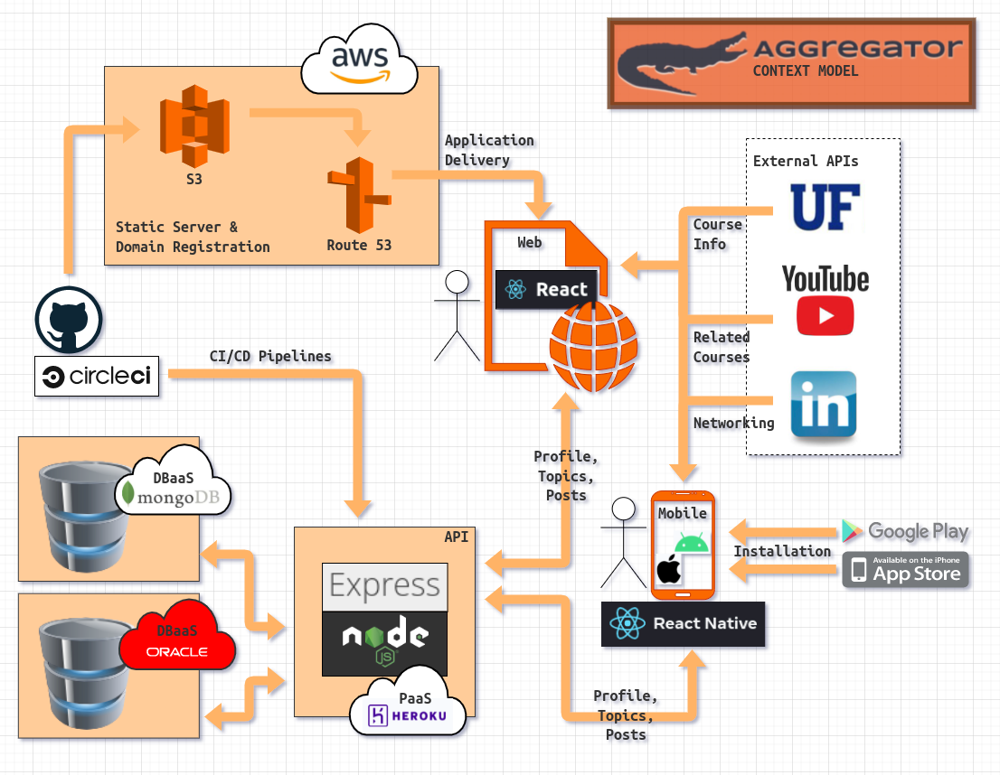

_CEN3031 - Intro to Software Engineering_  
_Spring 2022_

# Software Architecture and System Context Model - Group 3

- **[Brian Hoblin](https://github.com/GoonerBrian)**, _SCRUM Master/Developer_
- **[Alejandro Capellan](https://github.com/acapellan)**, _Project Manager/Developer_
- **[Jacob Boney](https://github.com/jacobboney)**, _Developer_
- **[Steven DeLoach](https://github.com/sfdeloach)**, _Developer_

## Software Architecture Description

The Aggregator project will be built with a hybrid monolithic and microservices architecture, loosely
based on a traditional MERN (MongoDB, ExpressJS, ReactJS, NodeJS) technology stack. It resembles a
traditional multi-tier client-server architecture in some aspects, however, since a single-page application
(SPA) will be delivered to the client's browser, a traditional dynamic web server such as Apache's HTTP
server will not be necessary.

### Microservices deliver the client-side application

We plan to serve our application to the client's browser using Amazon Web Services (AWS) Simple Storage
Service (S3). AWS S3 has an incredibly high capacity to serve static files and we plan to couple this
microservice with another service from AWS called Route 53, a domain name and registration service (DNS).
This microservice will allow us to register Aggregator with a unique and memorable website address,
and properly route traffic to the S3 bucket containing our React-built application.

### Monolithic architecture supports the backend API

Aggregator will communicate with an API built with ExpressJS. ExpressJS is a web application framework
that runs on a NodeJS runtime. We plan to host our API using the platform-as-a-service (PaaS) Heroku.
The API will communicate with two cloud-based database services, OracleDB and MongoDB. We plan to
leverage the best of both worlds with these two different types of databases. The SQL OracleDB will
provide us with a proven technology for consistent ACID transactions and the NoSQL MongoDB will provide
us with greater flexibility modeling our data and will be more efficient for aspects of our product
that are primarily read-only.

### External APIs

Aggregator will leverage information made available through the University of Florida, YouTube, and
LinkedIn external APIs.

### Continuous Integration/Continuous Deployment

The Aggregator team will use GitHub and CircleCI to continuously integrate and deploy our application.

### Future Mobile Application Development

The Aggregator team plans to leverage the power of React Native, and create native binaries of our
application for Android and iOS mobile devices.

## Software Context Model

